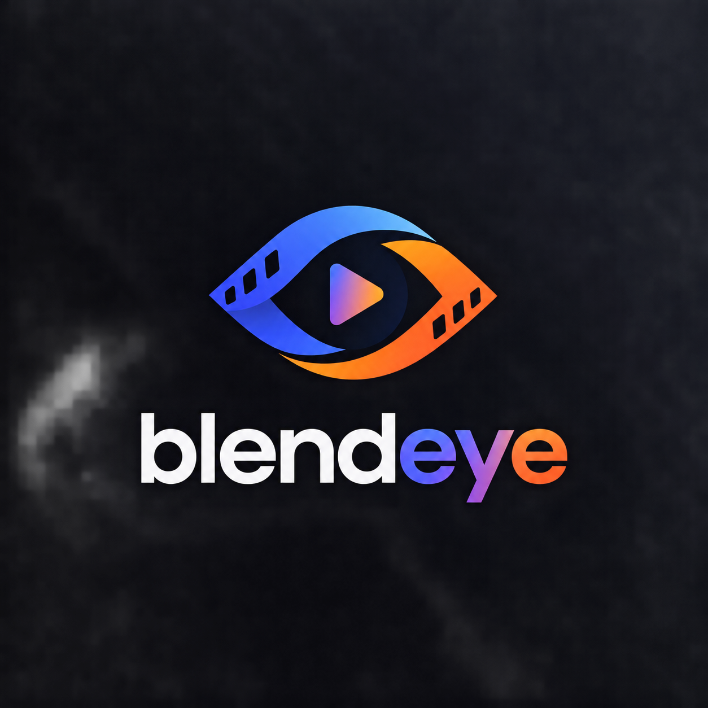
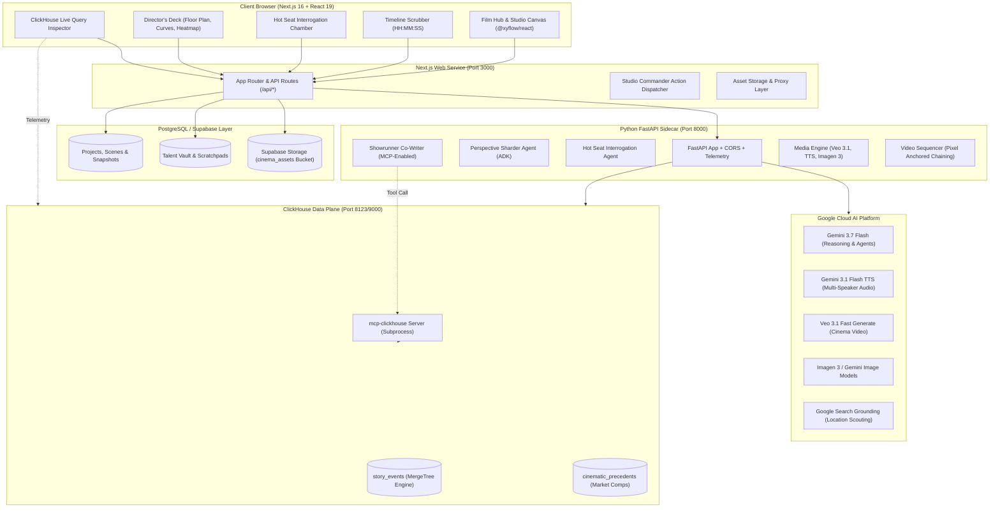

<p align="center">
  
</p>

<h1 align="center">BlendEye</h1>

<p align="center">
  <strong>The Writers' Room That Knows What Your Characters Know.</strong><br>
  <em>Built for the <strong>Google Cloud Agentic Cinema Hackathon</strong> — ClickHouse Partner Track</em>
</p>

<p align="center">
  🌐 <strong><a href="https://blendeye.harmanita.com">Live Demo — blendeye.harmanita.com</a></strong>
</p>
<br>

[](https://nextjs.org/)
[](https://fastapi.tiangolo.com/)
[](https://www.python.org/)
[](https://clickhouse.com/)
[](https://cloud.google.com/vertex-ai)
[](https://deepmind.google/technologies/veo/)
[](https://supabase.com/)
[](LICENSE)

---

## 📽️ Table of Contents

1. [Hackathon Submission Compliance](#-hackathon-submission-compliance) — see also [JUDGE_TESTING.md](JUDGE_TESTING.md)
2. [Executive Overview](#-executive-overview)
2. [Why BlendEye? (The Problem)](#-why-blendeye-the-problem)
3. [System Architecture](#-system-architecture)
4. [Key Features & Studio Modules](#-key-features--studio-modules)
   - [Interactive Story Canvas (React Flow)](#1-interactive-story-canvas-xyflowreact)
   - [ClickHouse Time-Gate Engine & Timeline Scrubber](#2-the-clickhouse-time-gate-engine--timeline-scrubber)
   - [The Hot Seat (Interrogation Chamber)](#3-the-hot-seat-interrogation-chamber)
   - [Centralized Showrunner AI & Script Supervisor](#4-centralized-showrunner-ai--script-supervisor)
   - [Studio AI Commander](#5-studio-ai-commander-natural-language-director)
   - [Audio Table Read & Vocal Synthesis](#6-audio-table-read-simulation--dsp-studio)
   - [The Director's Deck (Pre-Production Suite)](#7-the-directors-deck-pre-production-suite)
   - [Multiverse Takes & Film Fusion Engine](#8-multiverse-takes--film-fusion-engine)
   - [Veo 3.1 Chained Video Studio](#9-veo-31-cinematic-video-generation--chained-shot-sequencer)
   - [Character Lab & Talent Vault](#10-character-lab--talent-vault)
   - [Continuity Checker & Studio Version Control](#11-continuity-checker--studio-version-control)
   - [Production Asset Hub & Media Storage](#12-production-asset-hub--media-storage)
5. [ClickHouse Integration (Partner Track Centerpiece)](#-clickhouse-integration-partner-track-centerpiece)
6. [Google Cloud AI & Gemini Multimodal Suite](#-google-cloud-ai--gemini-multimodal-suite)
7. [Repository Structure](#-repository-structure)
8. [Local Development & Quickstart](#-local-development--quickstart)
9. [Docker Deployment](#-docker-deployment)
10. [Environment Variables Reference](#-environment-variables-reference)
11. [Benchmark Productions](#-benchmark-productions)
12. [License & Acknowledgments](#-license--acknowledgments)

---

## ✅ Hackathon Submission Compliance

| Requirement | Status |
| :--- | :--- |
| **Hosted, publicly reachable project** | [blendeye.harmanita.com](https://blendeye.harmanita.com) |
| **Google Cloud AI used at runtime** | `google-genai` + `google-adk` imported and called in `app/routers/media.py`, `app/services/video_sequencer.py`, `app/agents/*.py` — real `client.models.generate_content(...)` / `generate_videos(...)` calls, not just a model name in config |
| **ClickHouse used at runtime via `mcp-clickhouse`** | `app/services/clickhouse_mcp.py` launches the official `mcp-clickhouse` server and attaches it as a live `McpToolset` to the Showrunner agent (`app/agents/showrunner.py`) — see [§ ClickHouse Integration](#-clickhouse-integration-partner-track-centerpiece) |
| **ClickHouse Cloud / self-hosted cluster** | Production deployment connects to **ClickHouse Cloud** |
| **Runs on web** | Next.js 16 App Router, deployed and reachable above |
| **Open-source license detectable in repo root** | [MIT License](LICENSE) |
| **No non-Google-Cloud AI vendor at runtime** | Only `google-genai` / `google-adk` are called by the running application; no other AI SDK is imported or invoked anywhere in the codebase |

📋 **[Judge Testing Guide (JUDGE_TESTING.md)](JUDGE_TESTING.md)** — a 5-minute, step-by-step walkthrough to verify the ClickHouse time-gate mechanic and Google Cloud AI integrations live on the hosted deployment, no code reading required.

---

## 🌟 Executive Overview

**BlendEye** is an interactive, multi-agent virtual writers' room and cinematic pre-production studio. Screenwriters, showrunners, and directors can map out complex screenplays on an infinite visual backlot canvas, scrub an interactive timeline to any minute of the story runtime, and **interrogate characters live in the "Hot Seat"** — where characters are bounded by strict, sub-millisecond **ClickHouse time-gated knowledge firewalls**.

Ask a character where the missing vault keys are at **Minute 34**, and they answer with honest, believable ignorance. Scrub forward to **Minute 52** after a clandestine betrayal, and their entire worldview, emotional state, and testimony shift automatically.

The entire experience combines **ClickHouse's ultra-low-latency temporal query capabilities** with **Google Cloud's bleeding-edge generative AI models** (Gemini 3.7 Flash, Gemini 3.1 Flash TTS multi-speaker audio, Veo 3.1 video generation, and Imagen 3 visual concept art).

---

## 💡 Why BlendEye? (The Problem)

In traditional screenwriting and filmmaking, writers constantly fight two pervasive problems:
1. **Character Omniscience ("Writer Leakage")**: Characters often speak as if they've read the end of the script. They foreshadow twists they shouldn't know, fail to react with authentic paranoia, or lack the genuine blind spots of people acting in incomplete information environments.
2. **Disconnected Pre-Production Workflows**: Screenplay drafting, character psychological profiles, 2D camera blocking, shooting schedules, location dossiers, and musical scoring happen in siloed tools, leading to continuity breaks and compromised pacing.

**BlendEye solves this** by treating character memory as a queryable, time-stamped temporal stream backed by a high-performance column database, surrounded by an end-to-end directorial workbench.

---

## 🏗️ System Architecture

BlendEye uses a decoupled, hybrid architecture separating frontend presentation, state persistence, and stateless AI/analytical compute:



---

## 🎛️ Key Features & Studio Modules

### 1. Interactive Story Canvas (`@xyflow/react`)
- **Cinematic Visual Backlot**: A dark-mode, anamorphic-inspired node canvas built with React Flow.
- **Specialized Node Graph Hierarchy**:
  - **Inspiration Node**: Project logline, genre tags, director style cues, and core story secrets.
  - **Scene Master Node**: Script synopsis, screenplay excerpt, scene placement timecode, and direct script editor launcher.
  - **Character Perspective Nodes**: Visual cast cards with live character dials, subtext ratios, and current knowledge states.
  - **Storyboard Visual Node**: 2.39:1 anamorphic widescreen keyframes generated with Imagen 3.
  - **Director's 2D Floor Plan Node**: Direct architectural blocking overlay linked to the scene.
  - **Bridge Scene Node**: Interstitial scene linking multiple narrative sequences together.
- **Auto-Tidy Backlot**: Deterministic horizontal layout organizer keeping production nodes organized cleanly as projects scale.

### 2. The ClickHouse Time-Gate Engine & Timeline Scrubber
- **Interactive Scrubber**: Drag through the 90-minute (or customized) runtime with precision timecode readout (`00:34:00`, `00:52:00`).
- **Real-Time Knowledge Strip**:
  - **Verified Known Facts**: What the character genuinely witnessed, heard, or possessed.
  - **Critical Firewall Ignorance**: The deliberate secrets, unseen betrayals, and blind spots the character *cannot* know.
- **Sub-millisecond Retrieval**: ClickHouse evaluates timeline bounds in 1–3ms, eliminating expensive LLM passes on simple timeline movement.

### 3. The Hot Seat (Interrogation Chamber)
- **Live Character Interrogation**: Chat directly with any character in Hollywood dialogue script format (`CHARACTER: Line`).
- **Strict Knowledge Firewall**: The agent responds only using knowledge established up to that minute. If you try to bait them with future plot twists, they treat it as unfounded speculation, paranoia, or outright lies.
- **"Insert into Script"**: Found an improvised line or confession that crackles with tension? Click the filmstrip button to insert the generated dialogue directly into the screenplay draft.

### 4. Centralized Showrunner AI & Script Supervisor
- **Omniscient Creative Co-Pilot**: An AI executive showrunner analyzing dramatic subtext, pacing flaws, and narrative stakes.
- **Grounding via `mcp-clickhouse`**: The showrunner queries ClickHouse's `cinematic_precedents` table to cite real commercial precedents (e.g. *Heat*, *Sicario*, *Alien*) and historical audience retention curves.
- **Interactive Script Doctoring**: Apply targeted rewrites, heighten subtext, or inject narrative reversals directly through conversation.

### 5. Studio AI Commander (Natural Language Director)
- **Centralized Action Dispatcher**: Direct the entire studio with natural language commands (e.g., *"Add a corrupt security officer named Silas"*, *"Increase the dramatic tension in the third beat"*, *"Rearrange nodes and check continuity"*).
- **Multi-Step CRUD Automation**: Automatically creates characters, edits scenes, spawns nodes, updates screenplay text, and dispatches version snapshots in one shot.

### 6. Audio Table Read Simulation & DSP Studio
- **Multi-Speaker Vocal Table Reads**: Synthesizes full script table reads using **Gemini 3.1 Flash TTS** with `MultiSpeakerVoiceConfig`.
- **Character Voice Timbre Mapping**: Automatically maps characters to distinct vocal profiles (`Fenrir`, `Aoede`, `Charon`, `Kore`, `Puck`, `Zephyr`).
- **Synchronized Visualizer**: Dual audio canvas visualization with synchronized line-by-line highlighting as dialogue plays.
- **Audio DSP Controls**: Fine-tune character delivery style, playback speed (0.8x–1.3x), pitch shifting, formant chest resonance, and acoustic space reverb (Studio, Cathedral, Metal Vault).

### 7. The Director's Deck (Pre-Production Suite)
- **2D Floor Plan & Spatial Camera Blocking**:
  - Architectural stage schematic with draggable actor tokens and camera placements.
  - Camera setup presets: Wide Master (35mm), Over-The-Shoulder (50mm), Intimate Close-Up (85mm), Suspense Overhead POV (24mm).
  - Actor sightline vectors, practical lighting beams, and lens focal-length indicators.
- **Dramatic Tension & Pacing Curve**:
  - Recharts 3-act narrative tension visualizer.
  - Plots scene intensity, overall dramatic stakes, and individual character POV tension against runtime seconds.
- **Global Territory Heatmap & Box Office Intelligence**:
  - Interactive D3 Geo / TopoJSON global market projection map.
  - ClickHouse-queried commercial benchmarks and audience retention percentages across North America, Europe, Asia-Pacific, Latin America, and MENA.
- **Production Stripboard & Shooting Logistics**:
  - Hollywood standard day/night production strips with INT/EXT classification, page counts, cast numbers, and budget tier estimation.
- **Location Scouting & Research Dossier**:
  - Deep location scouting powered by Gemini with **Google Search Grounding**.
  - Fetches real-world architectural descriptions, coordinates, sun angles, seasonal weather considerations, and filming permit notes.
- **Director's Aesthetic Lookbook**:
  - Visual styling reference board with color palettes, lighting cues, costume palettes, and atmospheric reference art.

### 8. Multiverse Takes & Film Fusion Engine
- **Multiverse Alternate Takes Studio**:
  - Generate 3 radically different directorial takes per scene with one click:
    - *Psychological Slow-Burn (A24 Style)*: Whispered subtext, negative space, agonizing pregnant pauses.
    - *Neo-Noir Confrontation (Michael Mann / David Fincher)*: Razor-sharp dialogue, cold procedural calculation, rhythmic intensity.
    - *Visceral Ticking Clock (Christopher Nolan / Denis Villeneuve)*: Urgent sensory pressure, breathless dialogue, relentless pacing.
  - 1-click apply to the production screenplay.
- **Film Fusion Engine (Multiverse Crossover)**:
  - Reconciles two completely different screenplays, merges character casts, resolves contradictory timeline events, and synthesizes a unified, sharded ClickHouse story timeline.

### 9. Veo 3.1 Cinematic Video Generation & Chained Shot Sequencer
- **Veo 3.1 Fast Video Generation**: Direct renders of 4–8 second high-definition 2.39:1 / 16:9 cinematic video clips conditioned on storyboard prompts and character reference art.
- **Sequential Chained Shot Studio (`services/video_sequencer.py`)**:
  - Overcomes the single-shot 4–8s ceiling to generate continuous multi-shot scene sequences.
  - **Pixel Anchoring**: Automatically extracts the last frame of Shot $N$ (`frame_extractor.py`) and feeds it into Veo 3.1 as the image-conditioning reference for Shot $N+1$, preventing visual drift.
  - **Locked Continuity Bibles**: Per-shot prompt generation from a rigid continuity bible (lighting, wardrobe, blocking) to eliminate compounding hallucinations across long chains.

### 10. Character Lab & Talent Vault
- **Deep Character Architect**: Build rich character profiles with psychological archetypes, speech cadences, subtext ratios, and casting comps.
- **Personality Dials**: Calibrate confidence, verbal pacing, emotional volatility, and unique quirks.
- **Talent Vault Persistence**: Save created talent globally in Supabase for reuse across different productions.

### 11. Continuity Checker & Studio Version Control
- **Deep Script Continuity Analysis**: An automated script supervisor detecting timeline paradoxes, unearned knowledge slips, character motivation contradictions, and missing props.
- **Studio VCS (Version Control)**: Full project snapshots with undo/redo, revision summaries, and rollback capabilities.

### 12. Production Asset Hub & Media Storage
- **Media Asset Library**: Central management for generated character portraits, storyboard stills, Veo video takes, floor plan schematics, and audio tracks.
- **Supabase Storage Integration**: Assets are backed by the `cinema_assets` public storage bucket with CDN delivery and metadata tagging.

---

## ⚡ ClickHouse Integration (Partner Track Centerpiece)

ClickHouse is not a passive database in BlendEye — **it is the fundamental data engine powering the time-gate mechanic**:

```
+---------------------------------------------------------------------------------------+
| CLICKHOUSE TIME-GATE ENGINE                                                           |
|                                                                                       |
|   Master Script                                                                       |
|         │                                                                             |
|         ▼                                                                             |
|   Perspective Sharder Agent                                                           |
|         │                                                                             |
|         ▼                                                                             |
|   ┌───────────────────────────────────────────────────────────────────────────────┐   |
|   │ ClickHouse `story_events` Table                                               │   |
|   │ ORDER BY (project_id, character_name, event_timestamp)                        │   |
|   └───────────────────────────────────────────────────────────────────────────────┘   |
|         │                                                                             |
|         │   TIMELINE SCRUBBER (e.g. 00:34:00)                                         |
|         ▼                                                                             |
|   SELECT event_type, content FROM story_events                                        |
|   WHERE project_id = ? AND character_name = ? AND event_timestamp <= '00:34:00'       |
|   ORDER BY event_timestamp                                                            |
|         │                                                                             |
|         ▼ [1-3ms query latency]                                                       |
|   ┌───────────────────────────────────────────────────────────────────────────────┐   |
|   │ Knowledge Firewall Context Fed to Gemini Hot-Seat Agent                       │   |
|   │ Only knows: keys in vest                                                      │   |
|   │ Explicitly UNAWARE of: Elena's betrayal                                       │   |
|   └───────────────────────────────────────────────────────────────────────────────┘   |
+---------------------------------------------------------------------------------------+
```

### 1. `story_events` MergeTree Table
```sql
CREATE TABLE IF NOT EXISTS story_events (
    project_id String,
    character_name String,
    event_timestamp String,   -- HH:MM:SS format, lexicographically sortable
    event_type Enum8('known_fact' = 1, 'unaware_of' = 2, 'location' = 3, 'objective' = 4),
    content String,
    created_at DateTime DEFAULT now()
) ENGINE = MergeTree()
ORDER BY (project_id, character_name, event_timestamp);
```

### 2. Time-Gate Query Pattern
Every scrub on the timeline or question asked in the Hot Seat executes:
```sql
SELECT event_type, content
FROM story_events
WHERE project_id = {project_id:String}
  AND character_name = {character_name:String}
  AND event_timestamp <= {at_timestamp:String}
ORDER BY event_timestamp;
```

### 3. `cinematic_precedents` Table (Commercial Grounding)
Powers box-office intelligence, territorial comps, and audience retention metrics cited by the Showrunner:
```sql
CREATE TABLE IF NOT EXISTS cinematic_precedents (
    genre String,
    trope String,
    historical_reference String,
    tension_level Float32,
    commercial_territory String,
    audience_retention_pct Float32,
    precedent_example String
) ENGINE = MergeTree()
ORDER BY (genre, trope);
```

### 4. `mcp-clickhouse` Integration (Runtime Agent Tool-Use)
BlendEye uses ClickHouse through **two real, runtime-invoked paths** — not a README-only mention:

- **Direct driver** (`clickhouse-connect`): `app/services/clickhouse_store.py` — the Story Event Engine's own reads/writes (timeline scrubbing, event sharding). This is application logic, not agent reasoning.
- **Official MCP server** (`mcp-clickhouse`): `app/services/clickhouse_mcp.py` launches the official `mcp-clickhouse` console script as a stdio subprocess and wires it into Google ADK as an `McpToolset`. This toolset is attached directly to the **Showrunner agent** (`app/agents/showrunner.py`, `build_showrunner_agent`), so the agent can issue live, read-only ClickHouse queries as part of its own tool-calling loop mid-conversation — e.g. pulling `cinematic_precedents` rows to ground a script note in a real commercial comp — fulfilling the track's requirement that ClickHouse be used "via the official ClickHouse MCP server, connecting to a ClickHouse Cloud or self-hosted cluster" at runtime.

```python
# app/services/clickhouse_mcp.py
from google.adk.tools.mcp_tool.mcp_toolset import McpToolset
from mcp import StdioServerParameters

def build_clickhouse_toolset() -> McpToolset:
    return McpToolset(
        connection_params=StdioServerParameters(
            command="mcp-clickhouse", args=[], env=env,
        ),
    )

# app/agents/showrunner.py — attached to the live agent
tools.append(build_clickhouse_toolset())
Agent(..., tools=tools)
```

The production deployment connects to a **ClickHouse Cloud** cluster (not just local Docker), so both the direct-driver time-gate queries and the agent's MCP tool calls run against a real hosted instance at `blendeye.harmanita.com`.

### 5. Live Query Inspector & Telemetry
The frontend includes a real-time **ClickHouse Query Inspector** modal displaying:
- Exact executed SQL strings
- Server response times (averaging 1–4ms)
- Number of sharded events analyzed
- Studio `/metrics` endpoint ready for Grafana Labs telemetry

---

## 🤖 Google Cloud AI & Gemini Multimodal Suite

BlendEye harnesses Google Cloud's multimodal model family:

| Capability | Model | Role in Studio |
| :--- | :--- | :--- |
| **Reasoning & Agents** | `gemini-3.7-flash` | Master screenplay authoring, perspective sharding, Hot Seat interrogation, Showrunner script doctoring, continuity checking, and studio action orchestration |
| **Multi-Speaker TTS** | `gemini-3.1-flash-tts-preview` | Theatrical multi-speaker audio table reads with native `MultiSpeakerVoiceConfig`, prebuilt actor timbres (`Fenrir`, `Aoede`, etc.), and DSP room acoustics |
| **Video Generation** | `veo-3.1-fast-generate-preview` | 2.39:1 widescreen video renders, camera motion control, and sequential multi-shot chained generation with last-frame pixel conditioning |
| **Visual Concepts** | `gemini-3.1-flash-image` / `gemini-3-pro-image` | Anamorphic storyboard keyframes, character wardrobe portraits, and director lookbook moodboards |
| **Grounding** | Google Search Grounding | Location scouting research fetching verified geographical coordinates, architectural details, and seasonal filming conditions |

---

## 📂 Repository Structure

```
agentic_cinema/
├── README.md                          # Comprehensive project documentation
├── DEMO_VIDEO_SCRIPT.md               # 3-minute hackathon walkthrough video script
├── DEVPOST_SUBMISSION.md              # Official hackathon submission write-up
├── docker-compose.yml                 # Local ClickHouse & full-stack container profiles
├── .env.example                       # Root environment variable template
├── supabase/
│   └── schema.sql                     # PostgreSQL tables, RLS policies, and Storage bucket
├── agent-service/                     # Python 3.12 / FastAPI Sidecar
│   ├── pyproject.toml                 # Project metadata & locked dependencies (uv)
│   ├── uv.lock                        # Deterministic dependency lockfile
│   ├── Dockerfile                     # Container definition for Python sidecar
│   ├── app/
│   │   ├── main.py                    # FastAPI entrypoint, CORS, routers, /metrics
│   │   ├── config.py                  # Pydantic Settings & environment validation
│   │   ├── agents/                    # Gemini & Google ADK autonomous agents
│   │   │   ├── hot_seat.py            # Time-gated character interrogation
│   │   │   ├── perspective_sharder.py # Screenplay event extraction into ClickHouse
│   │   │   ├── showrunner.py          # Omniscient co-writer with MCP tool calling
│   │   │   ├── continuity_checker.py  # Script logic & paradox inspector
│   │   │   ├── character_lab.py       # Character generator & casting comp agent
│   │   │   ├── location_researcher.py # Location scouting with Google Search Grounding
│   │   │   ├── multiverse_takes.py    # 3-director take generator
│   │   │   └── shotlist_generator.py  # Continuity bible & shot planner
│   │   ├── routers/                   # REST API routes (media, script, hot-seat, etc.)
│   │   └── services/                  # ClickHouse store, MCP bridge, video sequencer
│   │       ├── clickhouse_store.py    # Direct ClickHouse driver operations
│   │       ├── clickhouse_mcp.py      # Official mcp-clickhouse server subprocess
│   │       ├── video_sequencer.py     # Multi-shot chained Veo generation
│   │       └── frame_extractor.py     # Last-frame pixel anchoring via OpenCV/PIL
└── web/                               # Next.js 16 App Router (TypeScript + Tailwind v4)
    ├── package.json                   # Web dependencies (@xyflow/react, Lucide, Recharts)
    ├── Dockerfile                     # Production Next.js container definition
    ├── app/                           # App router pages & API proxy routes
    │   ├── page.tsx                   # Studio Hub landing page
    │   ├── studio/[projectId]/page.tsx# Main interactive writers' room canvas
    │   └── api/                       # Next.js backend routes to Supabase & sidecar
    ├── components/
    │   ├── cinema/                    # Core Studio UI components
    │   │   ├── story-canvas.tsx       # React Flow canvas wrapper
    │   │   ├── graph-nodes.tsx        # Custom node designs (Scene, Character, Visual)
    │   │   ├── timeline-scrubber.tsx  # Timecode scrubber with event markers
    │   │   ├── hot-seat-chat.tsx      # Knowledge-bounded character chat
    │   │   ├── floor-plan-view.tsx    # 2D architectural camera blocking
    │   │   ├── tension-curve-view.tsx # 3-act narrative tension curves
    │   │   ├── table-read-player.tsx  # Multi-speaker audio player with visualizer
    │   │   ├── territory-heatmap-view.tsx # Global box office D3 map
    │   │   ├── generation-studio-view.tsx # Chained Veo video sequence view
    │   │   ├── character-lab-dialog.tsx   # Character creator & talent vault
    │   │   └── clickhouse-inspector.tsx   # Live SQL telemetry console
    │   └── ui/                        # shadcn/ui design primitives
    └── lib/                           # Stores, version control & client SDKs
        ├── project-store.ts           # Benchmark projects & reactive local state
        ├── studio-commander.ts        # AI Studio Commander multi-step action runner
        ├── supabase-store.ts          # Postgres/Supabase synchronization layer
        └── asset-store.ts             # Media asset library state
```

---

## 🚀 Local Development & Quickstart

### Prerequisites
- **Node.js**: v20+ with `npm`
- **Python**: v3.12+ with [uv](https://docs.astral.sh/uv/) installed
- **Docker**: For running ClickHouse locally
- **Google Cloud API Key**: A valid `GOOGLE_API_KEY` enabled for Gemini models
- **Supabase Account**: (Optional for demo, recommended for persistent multi-user accounts)

---

### Step 1: Clone the Repository & Configure Root Environment

```bash
git clone https://github.com/your-org/agentic_cinema.git
cd agentic_cinema

# Copy the root environment file
cp .env.example .env
```

Ensure `CLICKHOUSE_PASSWORD` in `.env` is set (e.g. `CLICKHOUSE_PASSWORD=devpassword`). ClickHouse HTTP authentication requires a real password.

---

### Step 2: Start ClickHouse in Docker

Run ClickHouse in background:
```bash
docker compose up -d clickhouse
```
- ClickHouse HTTP interface will be available at: `http://localhost:8123`
- Native TCP interface will be at: `localhost:9000`

---

### Step 3: Start the Python Agent Service

```bash
cd agent-service
cp .env.example .env
```

Edit `agent-service/.env` to include your `GOOGLE_API_KEY` and verify `CLICKHOUSE_PASSWORD` matches the root `.env`:
```env
GOOGLE_API_KEY=your_gemini_api_key_here
CLICKHOUSE_HOST=localhost
CLICKHOUSE_PORT=8123
CLICKHOUSE_USER=default
CLICKHOUSE_PASSWORD=devpassword
CLICKHOUSE_DATABASE=default
CLICKHOUSE_SECURE=false
```

Sync dependencies and start the FastAPI dev server:
```bash
uv sync
uv run uvicorn app.main:app --reload --port 8000
```
- Interactive API Documentation: `http://localhost:8000/docs`
- Health Check: `http://localhost:8000/health`
- Studio Telemetry: `http://localhost:8000/metrics`

---

### Step 4: Start the Next.js Frontend

In a new terminal:
```bash
cd web
cp .env.example .env
```

Edit `web/.env` with your URLs and Supabase credentials:
```env
AGENT_SERVICE_URL=http://localhost:8000
NEXT_PUBLIC_SUPABASE_URL=https://your-project.supabase.co
NEXT_PUBLIC_SUPABASE_ANON_KEY=your_supabase_anon_key
SUPABASE_SERVICE_ROLE_KEY=your_supabase_service_role_key
```

Install packages and run the Next.js development server:
```bash
npm install
npm run dev
```

Open [http://localhost:3000](http://localhost:3000) in your browser!

---

### Step 5: (Optional) Initialize Supabase Database

If using your own Supabase project:
1. Navigate to the SQL Editor in the Supabase Dashboard.
2. Paste the contents of `supabase/schema.sql` and run.
3. This provisions:
   - `projects`, `scratchpad_notes`, `talent_vault`, `project_snapshots`, `generation_cache`, and `assets` tables.
   - Row-Level Security (RLS) policies for authenticated and demo guest users.
   - The `cinema_assets` storage bucket for media uploads.

---

## 🐳 Docker Deployment

To build and run the entire stack (ClickHouse, Python sidecar, and Next.js) containerized:

```bash
# Provide GOOGLE_API_KEY in root .env, then run:
docker compose --profile full up --build
```

- **Web Application**: `http://localhost:3000`
- **Agent Service**: `http://localhost:8000`
- **ClickHouse**: `http://localhost:8123`

---

## ⚙️ Environment Variables Reference

| Variable | Scope | Description | Default |
| :--- | :--- | :--- | :--- |
| `GOOGLE_API_KEY` | Agent Service | Google Cloud GenAI API Key | *(Required)* |
| `GEMINI_MODEL` | Agent Service | Primary Gemini model identifier | `gemini-3.7-flash` |
| `GOOGLE_GENAI_USE_VERTEXAI` | Agent Service | Set `true` to authenticate via Vertex AI | `false` |
| `CLICKHOUSE_HOST` | Agent Service | Hostname of ClickHouse server | `localhost` / `clickhouse` |
| `CLICKHOUSE_PORT` | Agent Service | ClickHouse HTTP port | `8123` |
| `CLICKHOUSE_USER` | Agent Service | ClickHouse username | `default` |
| `CLICKHOUSE_PASSWORD` | Agent Service / Root | ClickHouse password | `devpassword` |
| `CLICKHOUSE_DATABASE` | Agent Service | Database name | `default` |
| `CLICKHOUSE_SECURE` | Agent Service | Enable SSL/TLS (set true for ClickHouse Cloud) | `false` |
| `AGENT_SERVICE_URL` | Web App | URL to access Python sidecar | `http://localhost:8000` |
| `NEXT_PUBLIC_SUPABASE_URL` | Web App | Supabase Project URL | *(Optional)* |
| `NEXT_PUBLIC_SUPABASE_ANON_KEY` | Web App | Supabase Anonymous Client Key | *(Optional)* |
| `SUPABASE_SERVICE_ROLE_KEY` | Web App | Supabase Service Role Secret Key | *(Optional)* |

---

## 🎬 Benchmark Productions

BlendEye comes out of the box with curated benchmark productions ready for immediate exploration:

### 1. *The Vault Heist* (Crime / Suspense Thriller)
- **Setting**: Sub-basement vault, Manhattan Financial District.
- **Dramatis Personae**:
  - **Marcus**: Vault technician with a code of ethics.
  - **Elena**: Tactical mastermind hiding a catastrophic corporate vendetta.
  - **Teo**: Lookout and communications specialist monitoring police frequencies.
- **The Scrubbing Revelation**:
  - Interrogate Marcus at `00:34:00`: Defends the keys in his canvas vest with honest ignorance.
  - Interrogate Marcus at `00:52:00`: After Elena locks the blast doors from the outside, Marcus realizes the keys were taken and reveals the backup airshaft.

### 2. *Deep Space Airlock* (Sci-Fi / Psychological Horror)
- **Setting**: Research Station *Charybdis*, Jovian Orbit.
- **Dramatis Personae**:
  - **Commander Vance**: Station veteran clinging to protocol under terminal decompression threats.
  - **Dr. Arlo**: Xenobiologist harboring contaminated orbital samples.
  - **Engineer Ray**: Life-support specialist struggling to balance oxygen reserves.
- **The Scrubbing Revelation**:
  - Interrogate Dr. Arlo before the quarantine seal breaches: Insists sample canisters are inert.
  - Interrogate Dr. Arlo post-breach: Confesses the biological organism reacts to electrical current.

---

## 📄 License & Acknowledgments

- Released under the **[MIT License](LICENSE)**.
- Built for the **Google Cloud Agentic Cinema Hackathon** (ClickHouse Partner Track).
- Powered by [Google Cloud AI](https://cloud.google.com/vertex-ai) and [ClickHouse](https://clickhouse.com/).
